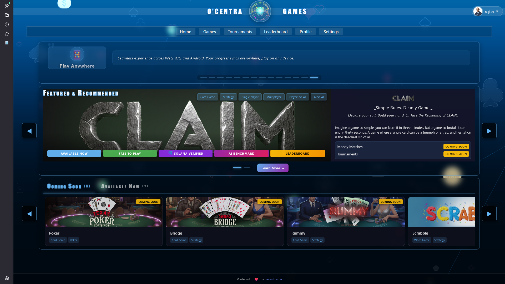

# 🎮 Ocentra Games

**A modern, blockchain-powered multiplayer card game platform** featuring intelligent AI opponents, decentralized match verification, and a flexible asset-based game system.



*Experience the future of multiplayer card gaming with blockchain verification, intelligent AI opponents, and seamless cross-platform gameplay.*

**🎮 [Play Now](https://game.ocentra.ca/)** | **🌐 [Visit Website](https://ocentra.ca/)**

---

## 🎯 What is Ocentra Games?

**Ocentra Games** is a next-generation multiplayer card game platform that combines:
- **Solana Blockchain** for decentralized match state and escrow management
- **Local & Cloud AI** for intelligent opponents powered by LLMs
- **Asset-Based Game System** for flexible, data-driven game modes
- **Event-Driven Architecture** for clean domain separation
- **Web3 Integration** for true ownership and verifiable gameplay

We're building a platform where game rules, AI behavior, and game modes are all **data-driven assets**, making it easy to create, modify, and deploy new games without code changes.

---

## ✨ Key Features

### 🎲 Multiple Card Games
- **Claim** - High-stakes strategic card collection with psychological warfare
- **Three Card Brag** - Fast-paced British card game with hand rankings
- **Texas Hold'em** - Classic poker with blockchain verification
- *More games coming...*

### 🤖 Intelligent AI Opponents
- **Local LLMs** - Run AI models directly in the browser (Transformers.js)
- **Cloud LLMs** - Support for OpenAI, OpenRouter, LM Studio, and more
- **Chain of Thought** - AI reasoning is captured and verifiable
- **Personality-Based** - Each AI has distinct playing styles

### ⛓️ Blockchain-Powered
- **Solana Integration** - Match state stored on-chain via Anchor program
- **Decentralized Escrow** - Player funds held securely on-chain
- **Verifiable Matches** - Full match records stored in Cloudflare R2
- **Leaderboard Snapshots** - Top 100 players recorded on-chain

### 🏗️ Flexible Architecture
- **Asset-Based System** - Games defined as `.asset` files (Unity ScriptableObject pattern)
- **Event-Driven** - Clean separation between UI, Engine, Solana, and AI domains
- **Phase-Based Development** - Systematic, spec-driven implementation
- **Multiplayer-First** - All games use multiplayer architecture, even single-player (1 human + AI)

---

## 🛠️ Tech Stack

### Frontend
- **React 19** + **TypeScript** + **Vite**
- **Zustand** for state management
- **React Query** for data fetching
- **EventBus** for cross-domain communication

### Blockchain
- **Solana** - On-chain game state and escrow
- **Anchor Framework** - Rust-based Solana program
- **Web3.js** + **Anchor Client** - TypeScript integration

### AI & ML
- **Transformers.js** - Local LLM inference in the browser
- **Multiple Providers** - OpenAI, OpenRouter, LM Studio, Native
- **Model Manager** - Dynamic model loading and switching

### Infrastructure
- **Cloudflare Workers** - Backend API and match coordination
- **Cloudflare R2** - Off-chain full match record storage
- **Durable Objects** - Stateful match coordination
- **IndexedDB** - Local caching and persistence

### Testing & Development
- **Vitest** - Unit testing
- **Playwright** - E2E testing
- **Anchor Tests** - Solana program testing
- **TypeScript** - Full type safety

---

## 📚 Documentation

**📖 Start Here:** [docs/ocentra/REPO-MINDMAP.md](docs/ocentra/REPO-MINDMAP.md) - Complete repository structure overview

### Quick Navigation

- **[Documentation Hub](docs/ocentra/README.md)** - Main documentation index
- **[Solana Integration](docs/ocentra/Multiplayer%20and%20Solana/README.md)** - Blockchain architecture and implementation
- **[Game Rules](docs/ocentra/GameRules/README.md)** - Rules for Claim, Three Card Brag, Texas Hold'em
- **[Game Mode System](docs/ocentra/Gamemode/README.md)** - Asset-based game mode architecture
- **[AI System](docs/ocentra/AILogic/README.md)** - LLM integration and prompt construction
- **[Architecture](docs/ocentra/Architecture/)** - Event-driven domains and UI structure
- **[Libraries](docs/ocentra/Lib/README.md)** - Core library documentation

### Implementation Phases

- **[Game Mode Assets](docs/ocentra/Phases/)** - Phases 1-6: Asset system implementation
- **[Rules Assets](docs/ocentra/Phases/phase-07-rules-asset-system.md)** - Phase 7: Rules asset system
- **[AI Integration](docs/ocentra/Phases/phase-08-ai-integration.md)** - Phase 8: AI integration with assets
- **[Solana Phases](docs/ocentra/Multiplayer%20and%20Solana/phases/)** - Phases 1-10: Blockchain implementation

---

## 🚀 Getting Started

### Prerequisites

- **Node.js 22+**
- **Rust** (for Solana program)
- **Anchor Framework** (for Solana development)
- **Cloudflare Account** (for R2 storage)

### Quick Setup

1. **Clone the repository**
   ```bash
   git clone <repository-url>
   cd ocentra-games
   ```

2. **Install dependencies**
   ```bash
   npm install
   ```

3. **Set up environment**
   ```bash
   cp .env.example .env
   # Edit .env with your configuration
   ```

4. **Start development server**
   ```bash
   npm run dev
   ```
   The game will be available at `http://localhost:3000`

5. **Run Solana tests** (in separate terminal)
   ```bash
   cd Rust/ocentra-games
   anchor test
   ```

### Live Demo

**🎮 Try it now:** [game.ocentra.ca](https://game.ocentra.ca/)  
**🌐 Visit our website:** [ocentra.ca](https://ocentra.ca/)

### Full Setup Guide

For detailed setup instructions, see:
- **[Local Development Guide](docs/ocentra/Multiplayer%20and%20Solana/local-development-guide.md)** - Complete setup walkthrough

---

## 🎮 Current State

### ✅ Implemented

- ✅ **Solana Program** - Complete Anchor program with match lifecycle, escrow, and leaderboards
- ✅ **Event-Driven Architecture** - EventBus system connecting UI, Engine, Solana, and AI domains
- ✅ **Game Engine** - Core game logic, rules, state management
- ✅ **AI System** - Local and cloud LLM integration with chain of thought
- ✅ **Match Recording** - Canonical serialization and verification
- ✅ **Cloudflare Infrastructure** - Worker API and R2 storage
- ✅ **UI Framework** - React components and pages for Claim and Three Card Brag
- ✅ **Test Infrastructure** - Comprehensive test suite (unit, integration, E2E)

### 🚧 In Progress

- 🚧 **Asset-Based Game System** - Migrating from code-based to asset-based game modes
- 🚧 **Rules Asset System** - Extracting rules into separate `.asset` files
- 🚧 **Game Editor** - Visual editor for creating and editing game assets
- 🚧 **Additional Games** - Texas Hold'em implementation

### 📋 Planned

- 📋 **More Card Games** - Bridge, Spades, Hearts, Rummy variants
- 📋 **Tournament System** - Organized competitions and brackets
- 📋 **NFT Integration** - Card collections and ownership
- 📋 **Mobile Apps** - Native iOS and Android via Capacitor
- 📋 **Social Features** - Friends, chat, spectating

---

## 🌟 What Makes Us Different?

### 1. **True Decentralization**
Unlike traditional game servers, Ocentra Games uses **Solana blockchain** for match state and escrow. This means:
- **No Central Server** - Match state is stored on-chain
- **Transparent Rules** - Game logic is verifiable on-chain
- **Player Ownership** - Funds held in smart contracts, not our wallets
- **Censorship Resistant** - No single point of failure

### 2. **Verifiable AI**
AI opponents use **chain of thought reasoning** that's captured and stored:
- **Transparent Decisions** - See why AI made each move
- **Reproducible Games** - Replay matches with same AI behavior
- **Fair Play** - AI reasoning is auditable
- **Research Platform** - Perfect for AI research and development

### 3. **Asset-Based Flexibility**
Games are defined as **data assets**, not code:
- **No Code Changes** - Create new games by adding `.asset` files
- **Rapid Iteration** - Modify game rules without redeploying
- **User-Generated Content** - Players can create and share game variants
- **Unity-Like Workflow** - Familiar ScriptableObject pattern for game developers

### 4. **Multiplayer-First Architecture**
Every game uses multiplayer architecture, even single-player:
- **Consistent Codebase** - Same code path for all games
- **Easy Scaling** - Add AI or human players seamlessly
- **Unified State** - One state management system for everything
- **Future-Proof** - Easy to add new player types (AI, human, spectator)

### 5. **Open & Extensible**
Built with openness in mind:
- **Documentation-First** - Comprehensive, spec-driven documentation
- **Phase-Based Development** - Clear roadmap and milestones
- **Modular Design** - Easy to extend and customize
- **Developer-Friendly** - Clean architecture and patterns

---

## 🏗️ Architecture Overview

```
┌─────────────────────────────────────────────────────────┐
│                    CLIENT LAYER                          │
│  React UI → EventBus → Game Engine → AI System         │
│              ↓              ↓            ↓              │
│          WebRTC P2P    Solana Client   Local LLM       │
└─────────────────────────────────────────────────────────┘
                        ↓         ↓
┌─────────────────────────────────────────────────────────┐
│                   BLOCKCHAIN LAYER                       │
│  Solana Network (Anchor Program)                        │
│  - Match State PDAs                                     │
│  - Escrow Accounts                                      │
│  - Leaderboard Snapshots                                │
│  - Game Registry                                        │
└─────────────────────────────────────────────────────────┘
                        ↓
┌─────────────────────────────────────────────────────────┐
│                    STORAGE LAYER                         │
│  Cloudflare R2 (Hot Storage)                           │
│  - Full Match Records                                   │
│  - Chain of Thought                                     │
│  - Match History                                        │
└─────────────────────────────────────────────────────────┘
```

**Key Principle:** All cross-domain communication is event-driven via EventBus
- **UI Domain** - React components and pages
- **Engine Domain** - Game logic and state
- **Solana Domain** - Blockchain integration
- **AI Domain** - LLM integration

---

## 📊 Project Statistics

- **Languages:** TypeScript, Rust, JavaScript
- **Total Lines of Code:** ~50,000+ (estimated)
- **Games:** 3 (Claim, Three Card Brag, Texas Hold'em)
- **AI Providers:** 4+ (OpenAI, OpenRouter, LM Studio, Native)
- **Test Coverage:** Comprehensive (unit, integration, E2E)
- **Documentation:** 100+ markdown files, spec-driven

---

## 🤝 Contributing

We welcome contributions! Please see our contributing guidelines:

1. **Read the Documentation** - Start with [REPO-MINDMAP.md](docs/ocentra/REPO-MINDMAP.md)
2. **Follow the Phases** - Check [Phases](docs/ocentra/Phases/) for implementation roadmap
3. **Code Style** - Follow ESLint + Prettier rules
4. **Write Tests** - Add tests for new functionality
5. **Update Docs** - Keep documentation in sync with code

---

## 📝 License

This repository is **public** for transparency and educational purposes, but the codebase is **not open source**. 

All code, documentation, and assets in this repository are **proprietary** and remain the intellectual property of Ocentra AI. See [LICENSE](LICENSE) for full terms.

**Key Restrictions:**
- ✅ You may view and study the code for learning purposes
- ❌ You may NOT copy, modify, distribute, or use commercially
- ❌ Unauthorized use is strictly prohibited

For licensing inquiries or collaboration opportunities, please contact us at [ocentra.ca](https://ocentra.ca/).

---

## 🔗 Links

### Live Platforms
- **🎮 Play Now:** [game.ocentra.ca](https://game.ocentra.ca/) - Live game platform
- **🌐 Website:** [ocentra.ca](https://ocentra.ca/) - Official website

### Code & Documentation
- **📦 GitHub Repository:** [ocentra/ocentra-games](https://github.com/ocentra/ocentra-games) - Source code
- **🏢 GitHub Organization:** [ocentra](https://github.com/ocentra) - Other projects
- **📚 Documentation:** [docs/ocentra/](docs/ocentra/)
- **🦀 Solana Program:** [Rust/ocentra-games/](Rust/ocentra-games/)
- **☁️ Cloudflare Worker:** [infra/cloudflare/](infra/cloudflare/)

### Connect
- **💼 LinkedIn Company:** [Ocentra AI](https://www.linkedin.com/company/ocentra) - Official company page
- **💼 LinkedIn:** [Sujan Mishra](https://www.linkedin.com/in/sujanmishra/) - Project creator

---

## 🙏 Acknowledgments

Built with:
- [Solana](https://solana.com/) - Blockchain infrastructure
- [Anchor](https://www.anchor-lang.com/) - Solana framework
- [React](https://react.dev/) - UI framework
- [Transformers.js](https://huggingface.co/docs/transformers.js) - Local ML inference
- [Cloudflare](https://www.cloudflare.com/) - Infrastructure
- And many other amazing open-source projects

---

**Last Updated:** 2025-01-20  
**Status:** Active Development  
**Version:** 0.1.0-alpha
